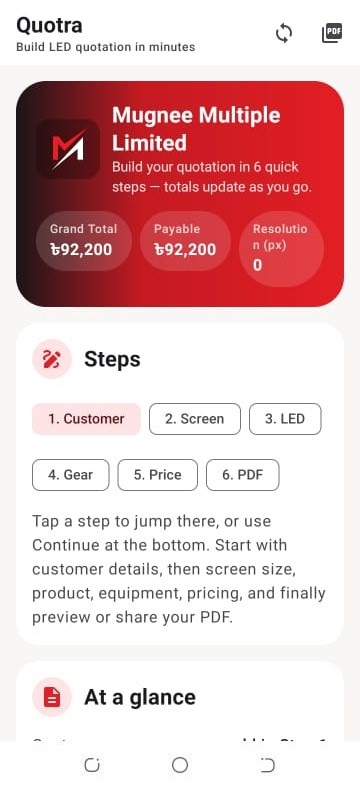
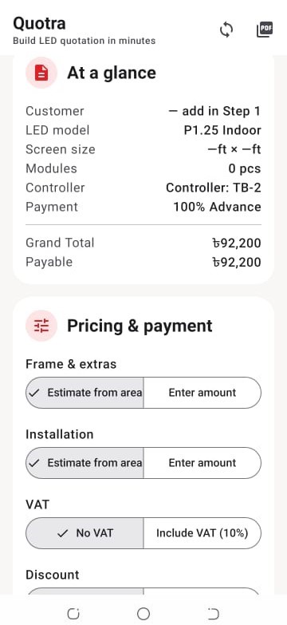
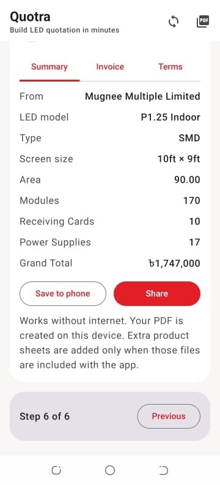

# Quotra

### Turn complex LED quotes into clear, client-ready proposals—in minutes, not meetings.

**Native Android · Offline-capable · Branded PDF output**

 

 

*A premium first touch—your brand leads before the first line item.*

---

## Why leaders care

| What slows sales today | What **Quotra** changes |
|------------------------|-------------------------|
| Pricing scattered across chats, sheets, and memory | **One guided path**—every line item follows the same rules your business already trusts |
| Re-work when someone used the wrong tier, tax, or add-on | **Built-in logic** for options, tiers, VAT/discounts, and commercial terms—fewer “sorry, let me resend that” moments |
| Weak or inconsistent documents going to the buyer | **Polished, branded PDFs** that look as serious as the deal you are trying to win |
| Dead air when Wi‑Fi fails on-site | **Works when connectivity doesn’t**—core quoting and PDF creation stay on the device |

> **Bottom line:** Your team spends less time fixing quotes and more time **closing**—with a document customers can **sign off** with confidence.

---

## At a glance

| | |
|:---|:---|
| **Best for** | Sales and estimation teams selling **LED displays**, **digital signage**, and **integrated AV** projects |
| **Experience** | A calm, **step-by-step** flow—totals update as you go; jump back to any step when the customer changes direction |
| **Output** | **Branded quotation** ready to **save**, **share**, or align with your **PDF** workflow |
| **Reliability** | **Offline-first** mindset: the field shouldn’t wait for the internet to catch up |
| **Governance** | Implementation stays **private**—see [Source & confidentiality](#source--confidentiality) |

---

## What your team gets

**Clarity under pressure**  
A single screen tells the story: who the customer is, what was specified, what it costs, and what is payable—before anyone asks.

**Control without spreadsheets**  
Frames, installation, VAT, discounts, and payment choices are handled in structured controls—not fragile manual cells.

**A document that sells**  
The final step brings the technical breakdown and totals together, with obvious actions to deliver the quote professionally.

**Confidence in the numbers**  
When pricing rules live inside the product—not in someone’s head—your brand stays consistent from the first call to the signed order.

---

## From first tap to signed quote

1. **Customer & context** — Capture who you are quoting and the essentials that frame the deal.  
2. **Screen & specification** — Lock in size, product choices, and the details that drive engineering and margin.  
3. **Commercial terms** — Apply taxes, discounts, payment logic, and add-ons the way **your** business already prices.  
4. **Review with certainty** — See the summary, invoice view, and terms before anything leaves the building.  
5. **Deliver** — Generate your **PDF**, **save** to the device, and **share**—without letting a weak signal block the moment.

---

## See the experience

*Workflow order—exactly how your team moves from overview to a quote ready to send.*

### The command center — steps, totals, and momentum

Know where you are in the sale, see payable totals update live, and move forward without losing the thread.

  

### Pricing & payment — decisions that stay transparent

Tune the commercial levers while the running total stays visible—ideal for fast alignment in front of the customer.

  

### The finish line — summary, PDF, save & share

Close the loop with a structured final review and clear **Save** / **Share** actions—**PDF creation stays on-device** when the network cannot be trusted.

  

<strong>Visual reference (file names)</strong>

| # | Asset | Highlights |
|---|--------|------------|
| 1 | `screenshots/01-splash-brand.jpeg` | Brand-forward splash (shown at top) |
| 2 | `screenshots/02-home-six-step-workflow.jpeg` | Six-step navigation; live totals |
| 3 | `screenshots/03-pricing-and-at-a-glance.jpeg` | Summary card; VAT/discount/installation controls |
| 4 | `screenshots/04-summary-save-and-share.jpeg` | Final review; PDF; save/share |

---

## Built for serious field sales

Quotra is delivered as a **native Android** application—responsive, familiar on commercial phones and tablets, and engineered for the realities of **site visits**, **trade floors**, and **travel**.

<strong>Technical foundation</strong> <em>(for IT & procurement)</em>

| Area | Details |
|------|---------|
| Platform | Android (modern API levels) |
| Language | Kotlin |
| Interface | Jetpack Compose, Material 3 |
| Structure | Clear separation of catalog, domain logic, export, and presentation |
| Data | Efficient, type-safe models; local preferences and cached catalog state |
| Networking | Standard HTTP client for **optional** online catalog refresh |
| Documents | PDF generation aligned to quotation layout and annex needs |
| Engineering | Gradle-based Android delivery pipeline |

<strong>Architecture — high level</strong>

- **Experience** — The guided flow your sellers actually use.  
- **Rules** — Where pricing and quotation structure stay authoritative.  
- **Catalog** — Defaults plus optional refreshed data, merged predictably.  
- **Export** — Document generation designed so **local success** is not blocked by the network.  

No implementation code is published in this repository; this summary supports **governance conversations**, not replication.

---

## Source & confidentiality

The **complete source code**, **integrations**, and **deployment assets** for this product are **private**—by design. That protects **client confidentiality**, **commercial terms**, **security posture**, and **intellectual property**.

If you are exploring a similar solution for your organization, we can align on scope, timeline, and an appropriate engagement model—including **NDA** where required.

---

## Mugnee IT Solution

**We build software that makes complex sales feel simple.**

[ **mugneeit.com** ](https://mugneeit.com)

---

### Ready for a product that matches how you sell?

Whether you need a **quotation platform**, a **mobile-first sales tool**, or a **document workflow** tied to configurable products, **Mugnee IT Solution** bridges the gap between **what your team knows** and **what your customer sees**.

**[Start a conversation → mugneeit.com](https://mugneeit.com)**
